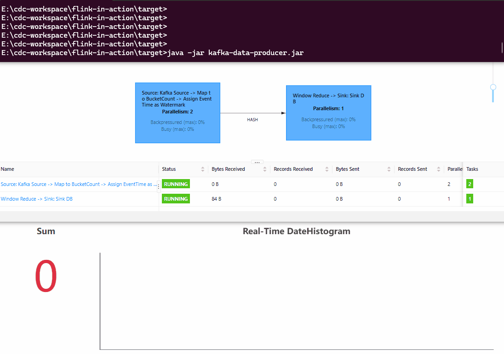
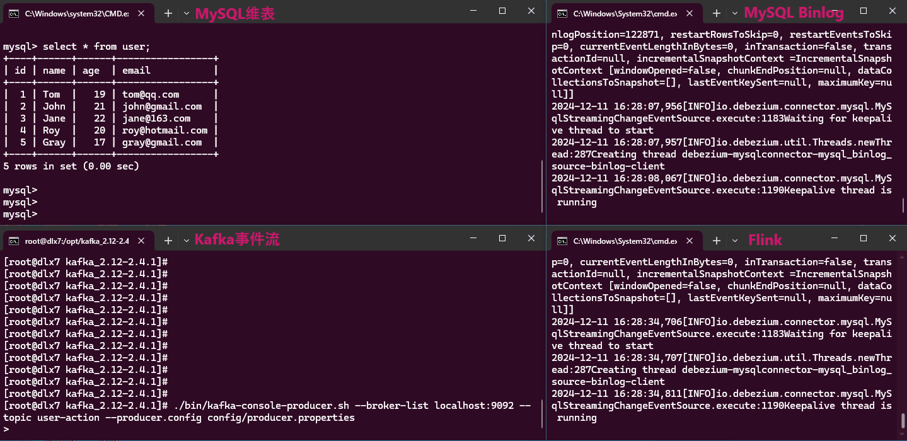

# Flink in action

Flink 实战系列文章，用实验+图解的方式入门 Flink 企业级应用开发。

- [Flink 实战之从 Kafka 到 ES](https://www.cnblogs.com/myownswordsman/p/-/from-kafka-to-es)
- [Flink 实战之 Real-Time DateHistogram](https://www.cnblogs.com/myownswordsman/p/-/flink-realtime-datehistogram)
- [Flink 实战之维表关联](https://www.cnblogs.com/myownswordsman/p/-/flink-dimextend)

部分实验附图：

